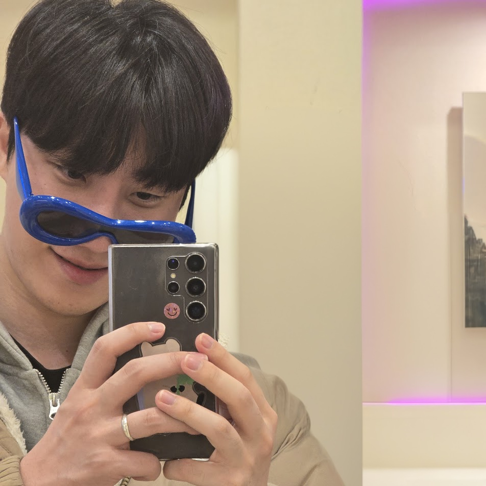
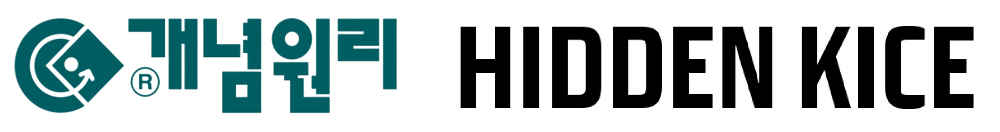
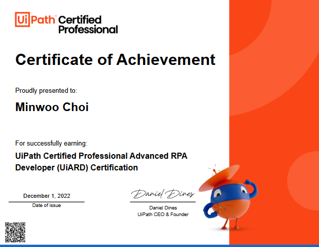

# Hi there, I'm Minwoo Choi 👋  

I’m a **Backend Developer** constantly seeking new challenges and growth opportunities.  
Currently a third-year **Computer Science** student at **Chungnam National University**, I’ve been honing my skills through a wide range of experiences.

 

---

## 🌟 Quick Overview

- **Backend Developer (Java/Spring, Python/Django)**
- **RPA (Robotic Process Automation) Developer**
- **Solution & Server Automation Specialist**
- **Problem Setter (Algorithmic Competitions)**
- **Passionate about Collaboration & Continuous Learning**

 

---

## 🤖 Military Service & RPA Experience
> 2021.10 ~ 2023.07, Software Developer (Military Service)

During my military service, I worked as a **Software Developer** in the **RPA (Robotic Process Automation)** team. My main focus was optimizing administrative workflows using:

- **Python** and **UiPath** to automate routine office tasks  
- Automated **pay calculation & disbursement** system for military personnel  
- **Leave management** workflow that significantly boosted overall efficiency  

This experience taught me the importance and potential of automation technology while sharpening my **problem-solving** skills.

 

---

## 💼 Growth at a Startup
> 2023.09 ~ Present, **Backend Developer** at [Mockingbird](https://mockingbird.co.kr/)

I’m currently a backend developer at **Mockingbird**, where I lead and contribute to various projects:

- **080 Opt-Out Integration**: Integrated an 080 opt-out feature into our text messaging system (Spring framework), reducing spam and improving trust.  
- **Payment & Cart System**: Built a cart and payment flow (Spring + Toss Payments API), enhancing user experience and revenue.  
- **Server Stabilization & Optimization**: Scaled and redesigned a heavily-loaded exam-generation server, reducing processing time by **up to 50x**.  
- **Coupon Feature**: Designed a DB schema and developed a coupon creation/management feature in Spring, boosting marketing initiatives.

> **Server Stabilization & Optimization**:  
> A sudden Twitter viral post caused a massive traffic spike, resulting in server overload. We expanded our infrastructure and introduced object reuse strategies, achieving much-improved performance and reliability.

 

### 🤝 B2B Outsourcing & Client Collaboration

While at **Mockingbird**, I’ve also worked on **B2B projects**, collaborating with various clients:

- **Mockingbird B2B SaaS Exam Demo**:  
  Developed a Windows-based **Django server** for a B2B SaaS solution. Closely coordinated with the backend team on APIs and DB design.
  
- **개념원리 Korean Converter**:  
  Collaborated with **개념원리** to build an API-based tool converting **HTML** to **HWPX**. Utilized **Python**, **Django**, and a custom **LaTeX2HANTEX** library.   
  Thorough documentation and iterative feedback ensured a successful project.
  
- **Hidden KICE Scoring Platform**:  
  Led backend development and database design. Deployed on AWS with DNS integration for high availability. Close communication with clients ensured precise requirement fulfillment.
  
- **시대인재 AI Subtitling Service**:  
  Single-handedly developed a large-scale **MP4 → Whisper API → SRT** subtitle generation pipeline. Tackled the 25MB API limit by splitting audio, parallel processing, and re-aligning timestamps. The resulting workflow drastically cut costs and time, earning praise for reliability and automation depth.

> These B2B projects have sharpened my **collaboration** and **project management** skills. I experienced the full development cycle—from requirement analysis to deployment and feedback—making me a more business-oriented developer.

 

---

## 📝 Past Experiences & Projects

### JEIL Academy (RPA Dev)
> 2020.06 ~ 2021.03  
While at **JEIL Academy**, I focused on streamlining processes in the education sector:

- **Image Conversion**: Used Python + OpenCV to convert PDF images to editable Korean documents.  
- **Video Processing**: Automated timeline creation for math lecture videos, reducing production time.  
- **Macros**: Developed macros in Hangul + Python to generate and auto-insert QR codes for textbooks.  
- **Automated Math Problem Generator**: Built an algorithmic system to auto-generate math questions.

### CNU Data Network Lab (Undergrad Research)
> 2021.05 ~ 2021.10  
At **Chungnam National University’s Data Network Lab**

- Improved **DMOJ** (online judge) by adding statistics and chart features (Django + Chart.js).  
- Developed a **Discord Bot** to match tutors and students (Python + Discord API).  
- Set up servers on **Ubuntu** for research and development environments.

 

---

## 🌐 Algorithms & Community Contribution

I have a deep passion for algorithms, competing in events like **UCPC**, **SCPC**, and **ICPC 2020 Korea**. I also contributed to the community by setting five problems for the 4th and 5th [“Thinking Programming Contest” on Baekjoon Online Judge](https://www.acmicpc.net/category/detail/2793).

 

## 🦠 The “Contactless” Problem-Solver

In 2020, when **COVID-19** forced a surge in online classes, I built a **Python + Selenium** tool to manage cyber lectures.  
Shared via Everytime (a Korean campus community), it exceeded **500 downloads**, and I received heartfelt messages from users—an inspiring moment in my development journey.

 

---

## 🎯 Tech Stack & Learning Goals

- **Languages**: Java, Python, C++  
- **Backend Frameworks**: Spring, Django  
- **Databases**: MySQL, PostgreSQL  
- **DevOps**: AWS, Docker, Kubernetes  
- **Others**: RESTful APIs, Selenium, OpenCV  

I’m currently focusing on deeper expertise in **Spring** and **Django**, aiming to build scalable and efficient servers. I believe a solid grasp of **HTTP protocols** and **RESTful APIs** is key to creating robust backend services. Keeping up with the latest tech trends helps me stay at the forefront of this rapidly evolving industry.

 

---

## 📜 Certifications

1. **UIARD (UiPath Advanced RPA Developer Certification)**  
   - Issued by: UiPath  
   - Date: December 1, 2022  

> Obtaining the UiPath Advanced RPA Developer Certification validated my expertise in automating complex workflows.
> This credential boosted my confidence and deepened my understanding of **RPA solutions**.

 

---

## 🌱 Collaboration & Growth

I firmly believe **development is a team effort**—we grow together by sharing insights and solving problems collectively. Through various team projects, I learned firsthand how **trust** and **communication** lead to success. When tackling challenges, I love brainstorming with teammates to discover the best solutions, and working closely with clients to meet (and exceed!) their needs. By leveraging each other’s strengths, we evolve as **well-rounded developers** ready to take on any challenge.

 

---

